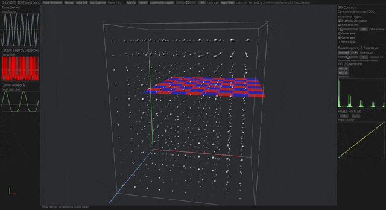
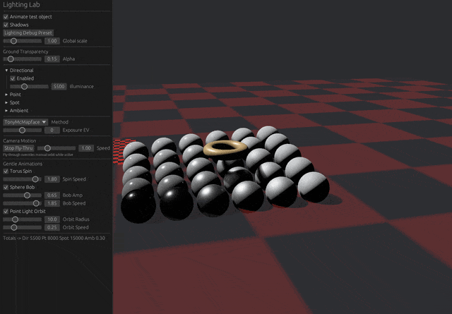
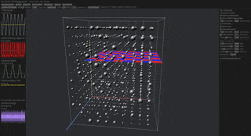

# dlinossrustcandle
➡ Notebooks quickstart: see [notebooks/README.md](./notebooks/README.md)

<!-- docs-index:start -->
<!-- Auto-generated by xtask docs-index. Do not edit between markers. -->
### Related READMEs

- [D-LinOSS Showcase Media](images_store/SHOWCASE/README.md)
- [D-LinOSS MCP VS Code Extension (Prototype)](vscode-extension/README.md)
- [Source Directory (`src/`)](src/README.md)
- [dlinoss-lighting-lab (relocated)](00DLinossrustPLAYGROUND/PGcrates/dlinoss-lighting-lab/README.md)
- [Jupytext Experiment Sub-crate](notebooks/jupytext-experiment-subcrate/README.md)
- [D-LinOSS Notebooks](notebooks/README.md)
- [dlinoss-lighting-lab](crates/dlinoss-lighting-lab/README.md)
- [Candle Probe (Migrated)](crates/dlinoss-helpers/src/probe/README.md)
- [dlinoss-mcp](crates/dlinoss-mcp/README.md)
- [Workspace Sub-Crates (`crates/`)](crates/README.md)
<!-- docs-index:end -->
## 🎬 Showcase (Preview GIFs)

Interactive simulation and visualization excerpts. Click a preview to open the full-size animated GIF (larger file) stored alongside other media in `images_store/`.
| Preview (click) | Scene | Notes |
|------------------|-------|-------|
| [](images_store/3dmatrixviewerflythrough.gif) | 3D Matrix Flythrough | Camera traverses volumetric lattice; demonstrates depth & energy field modulation. |
| [](images_store/dlinossrustcandleringandmovingballs.gif) | Ring & Moving Spheres | Multi-metric sphere scaling driven by latent energy & variance signals. |
| [](images_store/halugridanimation.gif) | Hallucinatory Grid | Complex wave mode + animated camera producing interference patterns. |

Full-resolution / archival videos (AVI / MP4 / WebM) and additional artifacts live under `images_store/` (large originals may use Git LFS if enabled). The `SHOWCASE/` subfolder intentionally contains only size‑controlled preview assets for fast page loads.
> If the previews do not animate on some Markdown renderers, open the image in a new tab or use the full-size link.

> 📋 **Quick Start**: Read [requirements.md](./requirements.md) for complete development setup  
> 🔧 **Architecture**: See [crates/README.md](./crates/README.md#sub-crates-overview) for workspace structure  DLiNOSS (Damped Linear Oscillatory State Space) layer implemented with Candlekos which was build on [Candle](https://github.com/huggingface/candle) tensors.

> 🧪 **Core Implementation**: See [src/README.md](./src/README.md#key-components) for D-LinOSS details  
> 🏗️ **Windows Binary**: [target/release/dlinoss_demo](./target/README.md#size-management) (CPU-only, no drivers needed)Notes:

- We use Candle's native scan-like ops (cumsum/exclusive_scan) and FFT where applicable. No custom scan/fft implementations.

**D-LinOSS** (Damped Linear Oscillatory State Space) layer implemented with [Candle](https://github.com/huggingface/candle) tensors, providing stable damped oscillatory dynamics for neural networks.- A small sub-crate `crates/dlinoss-augment` provides extension traits that simply wrap Candle APIs for ergonomics.

## 🚀 Quick Commands- Uses local path dependencies to your Candle checkout.

- Minimal forward pass using IMEX-like discretization.

```bash

# Test everything (smart discovery)## Usage

cargo run -p xtask -- discover-tests --run --features fft

Run examples (CPU):

# Build Windows .exe (CPU-only)

cargo build --release --bin dlinoss_demo  ```bash

# → Binary at: target/release/dlinoss_democargo run --example ultra_simple

cargo run --example simple_experiment

# Run examplescargo run --example viz_dual_pane

cargo run --example ultra_simplecargo run --example viz_tui

cargo run --features egui --example viz_dual_pane  ```

cargo run --features etui --example viz_tui
Run tests:

# Development workflow  
cargo run -p xtask -- verify-candle --fft && cargo run -p xtask -- ci```bash

```cargo test

## 📁 Repository Structure

Features (experimental, off by default):
| Directory | Purpose | Key Files |

|-----------|---------|-----------|- `parallel-scan`: reserved for a future parallel scan implementation. Public scan helpers (inclusive/exclusive prefix sums) are available; the true parallel recurrence is gated and unimplemented.
| **[`src/`](./src/README.md)** | Core D-LinOSS implementation | `dlinoss.rs`, `scan.rs`, `kernelize.rs` |- `fft`: enables Candle’s FFT support (used in examples for spectral visualization).

| **[`crates/`](./crates/README.md)** | Workspace sub-crates | `dlinoss-augment/`, `dlinoss-display/`, `dlinoss-helpers/` |
| **[`examples/`](./src/README.md#usage)** | Demo applications | `ultra_simple.rs`, `viz_dual_pane.rs`, `viz_tui.rs` |Optional example flags:

| **[`tests/`](./src/README.md#testing)** | Integration tests | `stability.rs`, `scan_tests.rs`, `smoke.rs` |
| **[`xtask/`](./crates/README.md#development)** | Development automation | Smart test discovery, candle verification |```bash

# Enable CUDA (if supported by your Candle build)

## 🎯 Key Featurescargo run --features cuda --example viz_dual_pane


### 📊 **Mathematical Foundation**# Enable FFT-backed bottom panes in the GUI example
- **Continuous-time SSM**: `ẋ = Ax + Bu, y = Cx + Du` with damped oscillatory dynamicscargo run --features fft --example viz_dual_pane

- **Exact discretization**: 2×2 block exponential for complex poles `p = -α ± iω`# Or in the TUI example
- **Provable stability**: `α > 0` ensures `ρ(A_d) < 1` in discrete domaincargo run --features fft --example viz_tui

```

### ⚡ **Execution Modes**

- **Sequential scan** (default): Always stable, CPU/GPU compatiblePython baselines (in the Python repo) should be run inside the venv and can use TEMPTEST scripts to avoid BatchNorm collectives.
- **Parallel scan** (feature-gated): Experimental, better performance for long sequences  

- **FFT kernelization** (feature-gated): Fastest for very long sequences, requires `fft` feature## XTask workflow


### 🔧 **Candle Integration**This workspace uses an `xtask` utility as the canonical entry point for development tasks. The default VS Code build task runs a Candle verification probe and then CI:
- **Path dependencies**: Uses local Candle workspace at `../from_github/candle`

- **No custom implementations**: Wraps Candle's `cumsum`/`exclusive_scan` and `rfft`/`irfft`- Verify Candle scan/fft and run CI: cargo run -p xtask -- verify-candle --fft && cargo run -p xtask -- ci
- **Cross-platform**: CPU (always), CUDA/Metal/MKL (feature-gated)- Run the TUI example via xtask: cargo run -p xtask -- run-tui

- Run the GUI example via xtask (with FFT): cargo run -p xtask -- --fft run-gui
## 🧪 Smart Testing System

## What the GUI example shows
Our xtask includes **smart test discovery** to prevent forgotten tests:

`viz_dual_pane` launches an egui window with two main plots (and optionally two bottom plots):

```bash

```markdown
# dlinossrustcandle

DLiNOSS (Damped Linear Oscillatory State Space) layer implemented on [Candle](https://github.com/huggingface/candle) tensors. CPU-first, FFT optional, with GUI/TUI demos and a single-dependency notebooks workflow.
➡ Notebooks quickstart: see [notebooks/README.md](./notebooks/README.md)

<!-- docs-index:start -->
<!-- Auto-generated by xtask docs-index. Do not edit between markers. -->
### Related READMEs

- [Source Directory (`src/`)](src/README.md)
- [D-LinOSS Notebooks](notebooks/README.md)
- [Candle Probe (Migrated)](crates/dlinoss-helpers/src/probe/README.md)
- [Workspace Sub-Crates (`crates/`)](crates/README.md)
<!-- docs-index:end -->

## Quick Start
- Read the project policy and goals: [requirements.md](./requirements.md)
- Canonical dev flow uses `xtask`:

```bash
# Verify Candle scan/fft + run fmt/clippy/tests
cargo run -p xtask -- verify-candle --fft && cargo run -p xtask -- ci

# Discover and run tests (incl. feature-gated via --features)
cargo run -p xtask -- discover-tests --run --features fft
## Run Examples

```bash
# Minimal CPU examples
cargo run --example ultra_simple
cargo run --example simple_experiment

# GUI (egui)
cargo run --features egui --example viz_dual_pane
cargo run --features egui,fft --example viz_dual_pane  # with FFT panes

# Terminal UI (ratatui)
cargo run --features etui --example viz_tui
cargo run --features etui,fft --example viz_tui
## Repository Structure

| Directory | Purpose |
|-----------|---------|
| [`src/`](./src/README.md) | Core D-LinOSS implementation (sequential scan, optional FFT) |
| [`crates/`](./crates/README.md) | Sub-crates: augment (Candle wrappers), display (egui/etui), helpers (CLI/probe) |
| [`examples/`](./src/README.md#usage) | Ultra simple, simple experiment, TUI/GUI demos |
| [`tests/`](./src/README.md#testing) | Integration tests (stability, shapes, scan ops) |
| [`notebooks/`](./notebooks/README.md) | Single-:dep glue crate and demo notebooks |
| [`xtask/`](./crates/README.md#development) | Dev automation (fmt, clippy, test, docs-index, probes) |
## Features (off by default)

| Feature | Purpose | Requires |
|---------|---------|----------|
| `fft` | FFT helpers/kernelization & spectrograms | Candle with FFT |
| `cuda` | NVIDIA GPU acceleration | CUDA Toolkit |
| `metal` | Apple GPU acceleration | macOS only |
| `mkl` | Intel MKL optimization | Intel MKL |
| `egui` | GUI visualization | X11/Wayland |
| `etui` | Terminal visualization | Terminal |
## Notes

- We use Candle's native scan ops (`cumsum`/`exclusive_scan`) and FFT where applicable. No custom scan/FFT reimplementations.
- Windows CPU binary can be built via `src/bin/dlinoss_demo.rs` (see [src/README.md](./src/README.md)).

## License

MIT OR Apache-2.0
# dlinossrustcandle

➡ Notebooks quickstart: see [notebooks/README.md](./notebooks/README.md)

<!-- docs-index:start -->
<!-- Auto-generated by xtask docs-index. Do not edit between markers. -->
### Related READMEs

- [D-LinOSS Showcase Media](images_store/SHOWCASE/README.md)
- [D-LinOSS MCP VS Code Extension (Prototype)](vscode-extension/README.md)
- [Source Directory (`src/`)](src/README.md)
- [dlinoss-lighting-lab (relocated)](00DLinossrustPLAYGROUND/PGcrates/dlinoss-lighting-lab/README.md)
- [Jupytext Experiment Sub-crate](notebooks/jupytext-experiment-subcrate/README.md)
- [D-LinOSS Notebooks](notebooks/README.md)
- [dlinoss-lighting-lab](crates/dlinoss-lighting-lab/README.md)
- [Candle Probe (Migrated)](crates/dlinoss-helpers/src/probe/README.md)
- [dlinoss-mcp](crates/dlinoss-mcp/README.md)
- [Workspace Sub-Crates (`crates/`)](crates/README.md)
<!-- docs-index:end -->

## 🎬 Showcase (Preview GIFs)

Interactive simulation and visualization excerpts. Click a preview to open the full-size animated GIF (larger file) stored alongside other media in `images_store/`.

| Preview (click) | Scene | Notes |
|------------------|-------|-------|
| [](images_store/3dmatrixviewerflythrough.gif) | 3D Matrix Flythrough | Camera traverses volumetric lattice; demonstrates depth & energy field modulation. |
| [](images_store/dlinossrustcandleringandmovingballs.gif) | Ring & Moving Spheres | Multi-metric sphere scaling driven by latent energy & variance signals. |
| [](images_store/halugridanimation.gif) | Hallucinatory Grid | Complex wave mode + animated camera producing interference patterns. |

Full-resolution / archival videos (AVI / MP4 / WebM) and additional artifacts live under `images_store/` (large originals may use Git LFS if enabled). The `SHOWCASE/` subfolder intentionally contains only size‑controlled preview assets for fast page loads.

> If the previews do not animate on some Markdown renderers, open the image in a new tab or use the full-size link.

> 📋 **Quick Start**: Read [requirements.md](./requirements.md) for complete development setup  

> 🔧 **Architecture**: See [crates/README.md](./crates/README.md#sub-crates-overview) for workspace structure  DLiNOSS (Damped Linear Oscillatory State Space) layer implemented with Candlekos which was build on [Candle](https://github.com/huggingface/candle) tensors.

> 🧪 **Core Implementation**: See [src/README.md](./src/README.md#key-components) for D-LinOSS details  

> 🏗️ **Windows Binary**: [target/release/dlinoss_demo](./target/README.md#size-management) (CPU-only, no drivers needed)Notes:

- We use Candle's native scan-like ops (cumsum/exclusive_scan) and FFT where applicable. No custom scan/fft implementations.

**D-LinOSS** (Damped Linear Oscillatory State Space) layer implemented with [Candle](https://github.com/huggingface/candle) tensors, providing stable damped oscillatory dynamics for neural networks.- A small sub-crate `crates/dlinoss-augment` provides extension traits that simply wrap Candle APIs for ergonomics.


## 🚀 Quick Commands- Uses local path dependencies to your Candle checkout.

- Minimal forward pass using IMEX-like discretization.

```bash

# Test everything (smart discovery)## Usage

cargo run -p xtask -- discover-tests --run --features fft

Run examples (CPU):

# Build Windows .exe (CPU-only)

cargo build --release --bin dlinoss_demo  ```bash

# → Binary at: target/release/dlinoss_democargo run --example ultra_simple

cargo run --example simple_experiment

# Run examplescargo run --example viz_dual_pane

cargo run --example ultra_simplecargo run --example viz_tui

cargo run --features egui --example viz_dual_pane  ```

cargo run --features etui --example viz_tui

Run tests:

# Development workflow  

cargo run -p xtask -- verify-candle --fft && cargo run -p xtask -- ci```bash

```cargo test

```

## 📁 Repository Structure

Features (experimental, off by default):

| Directory | Purpose | Key Files |

|-----------|---------|-----------|- `parallel-scan`: reserved for a future parallel scan implementation. Public scan helpers (inclusive/exclusive prefix sums) are available; the true parallel recurrence is gated and unimplemented.

| **[`src/`](./src/README.md)** | Core D-LinOSS implementation | `dlinoss.rs`, `scan.rs`, `kernelize.rs` |- `fft`: enables Candle’s FFT support (used in examples for spectral visualization).

| **[`crates/`](./crates/README.md)** | Workspace sub-crates | `dlinoss-augment/`, `dlinoss-display/`, `dlinoss-helpers/` |

| **[`examples/`](./src/README.md#usage)** | Demo applications | `ultra_simple.rs`, `viz_dual_pane.rs`, `viz_tui.rs` |Optional example flags:

| **[`tests/`](./src/README.md#testing)** | Integration tests | `stability.rs`, `scan_tests.rs`, `smoke.rs` |

| **[`xtask/`](./crates/README.md#development)** | Development automation | Smart test discovery, candle verification |```bash

# Enable CUDA (if supported by your Candle build)

## 🎯 Key Featurescargo run --features cuda --example viz_dual_pane


### 📊 **Mathematical Foundation**# Enable FFT-backed bottom panes in the GUI example

- **Continuous-time SSM**: `ẋ = Ax + Bu, y = Cx + Du` with damped oscillatory dynamicscargo run --features fft --example viz_dual_pane

- **Exact discretization**: 2×2 block exponential for complex poles `p = -α ± iω`# Or in the TUI example

- **Provable stability**: `α > 0` ensures `ρ(A_d) < 1` in discrete domaincargo run --features fft --example viz_tui

```

### ⚡ **Execution Modes**

- **Sequential scan** (default): Always stable, CPU/GPU compatiblePython baselines (in the Python repo) should be run inside the venv and can use TEMPTEST scripts to avoid BatchNorm collectives.

- **Parallel scan** (feature-gated): Experimental, better performance for long sequences  

- **FFT kernelization** (feature-gated): Fastest for very long sequences, requires `fft` feature## XTask workflow


### 🔧 **Candle Integration**This workspace uses an `xtask` utility as the canonical entry point for development tasks. The default VS Code build task runs a Candle verification probe and then CI:

- **Path dependencies**: Uses local Candle workspace at `../from_github/candle`

- **No custom implementations**: Wraps Candle's `cumsum`/`exclusive_scan` and `rfft`/`irfft`- Verify Candle scan/fft and run CI: cargo run -p xtask -- verify-candle --fft && cargo run -p xtask -- ci

- **Cross-platform**: CPU (always), CUDA/Metal/MKL (feature-gated)- Run the TUI example via xtask: cargo run -p xtask -- run-tui

- Run the GUI example via xtask (with FFT): cargo run -p xtask -- --fft run-gui

## 🧪 Smart Testing System

## What the GUI example shows

Our xtask includes **smart test discovery** to prevent forgotten tests:

`viz_dual_pane` launches an egui window with two main plots (and optionally two bottom plots):

```bash

```markdown
# dlinossrustcandle

DLiNOSS (Damped Linear Oscillatory State Space) layer implemented on [Candle](https://github.com/huggingface/candle) tensors. CPU-first, FFT optional, with GUI/TUI demos and a single-dependency notebooks workflow.

➡ Notebooks quickstart: see [notebooks/README.md](./notebooks/README.md)

<!-- docs-index:start -->
<!-- Auto-generated by xtask docs-index. Do not edit between markers. -->
### Related READMEs

- [Source Directory (`src/`)](src/README.md)
- [D-LinOSS Notebooks](notebooks/README.md)
- [Candle Probe (Migrated)](crates/dlinoss-helpers/src/probe/README.md)
- [Workspace Sub-Crates (`crates/`)](crates/README.md)
<!-- docs-index:end -->

## Quick Start

- Read the project policy and goals: [requirements.md](./requirements.md)
- Canonical dev flow uses `xtask`:

```bash
# Verify Candle scan/fft + run fmt/clippy/tests
cargo run -p xtask -- verify-candle --fft && cargo run -p xtask -- ci

# Discover and run tests (incl. feature-gated via --features)
cargo run -p xtask -- discover-tests --run --features fft
```

## Run Examples

```bash
# Minimal CPU examples
cargo run --example ultra_simple
cargo run --example simple_experiment

# GUI (egui)
cargo run --features egui --example viz_dual_pane
cargo run --features egui,fft --example viz_dual_pane  # with FFT panes

# Terminal UI (ratatui)
cargo run --features etui --example viz_tui
cargo run --features etui,fft --example viz_tui
```

## Repository Structure

| Directory | Purpose |
|-----------|---------|
| [`src/`](./src/README.md) | Core D-LinOSS implementation (sequential scan, optional FFT) |
| [`crates/`](./crates/README.md) | Sub-crates: augment (Candle wrappers), display (egui/etui), helpers (CLI/probe) |
| [`examples/`](./src/README.md#usage) | Ultra simple, simple experiment, TUI/GUI demos |
| [`tests/`](./src/README.md#testing) | Integration tests (stability, shapes, scan ops) |
| [`notebooks/`](./notebooks/README.md) | Single-:dep glue crate and demo notebooks |
| [`xtask/`](./crates/README.md#development) | Dev automation (fmt, clippy, test, docs-index, probes) |

## Features (off by default)

| Feature | Purpose | Requires |
|---------|---------|----------|
| `fft` | FFT helpers/kernelization & spectrograms | Candle with FFT |
| `cuda` | NVIDIA GPU acceleration | CUDA Toolkit |
| `metal` | Apple GPU acceleration | macOS only |
| `mkl` | Intel MKL optimization | Intel MKL |
| `egui` | GUI visualization | X11/Wayland |
| `etui` | Terminal visualization | Terminal |

## Notes

- We use Candle's native scan ops (`cumsum`/`exclusive_scan`) and FFT where applicable. No custom scan/FFT reimplementations.
- Windows CPU binary can be built via `src/bin/dlinoss_demo.rs` (see [src/README.md](./src/README.md)).

## License

MIT OR Apache-2.0
```

